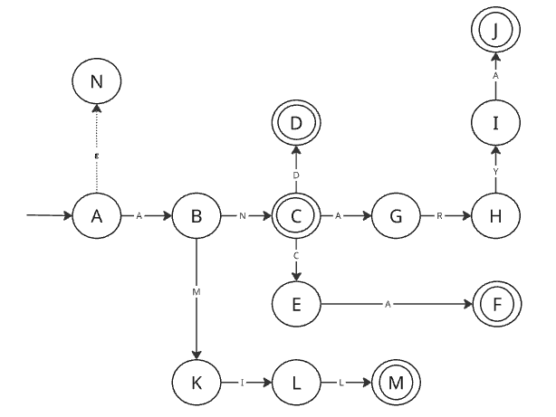

# Evidencia 1: Implementación de Analisis Lexico
### Nombre: Luis Fernando Martinez Barragan | Matrícula: A01613426

## Descripción

El lenguaje que elegí es el lenguaje "Elfico", también conocido como Quenya, que Omniglot.com es una lengua construida creada por J. R. R. Derivada del ingles antiguo, el Finlandes y el latin. Talkien lo creo para los Elfos en su ficción de la Tierra Media. 

Las palabras a modelar son las siguientes: 

- Amil - palabra Quenya para 'Madre'
- An - 'Largo'
- Anarya - palabra para 'Dia del Sol', este hace referencia al segundo dia elfico.
- Anca - palabra que significa 'Mandibulas'
- And - 'Largo'

Segun FasterCapital (2025), El uso de un Automata Finito es la manera mas sencilla de reconocer patrones, y existen dos tipos: DFA y NFA. Un DFA (Automata Finito Determinista) solo puede ir a un estado y el NFA puede ir a varios estados con la misma entrada.

Para este proyecto decidi utilizar un DFA, ya que el objetivo es aceptar solo estas cinco palabras por lo que se puede seguir un solo camino para cada palabra y no se necesita un NFA. Ademas la ambiguedad de un NFA lo haria algo complicado de implementar. 

## Modelos

Solo genere un automata para este lenguaje, ya que este representa las cinco palabras. El automata solo es válido para el siguiente alfabeto:

**Σ = {A, m, i, l, n, a, r, y, c, d}**

Cualquier carácter que no esté en el alfabeto y que no aparezca explícitamente en el autómata no es aceptado.



Otra forma de representar el automata es mediante una expresión regular. MongoDB (2025) menciona que ls expresiones regulares son patrones que se utilizan para hacer coincidir combinaciones de caracteres en cadenas. Entonces teniendolo en cuenta, el automata que diseñe se puede expresar de esta manera:

(^A)((mil)|(n(ε|arya|ca|d)))


## Implementación
 
Utilice el autómata para crear una base de datos en prolog, esta tiene el estado actual, el siguiente estado y la letra como derivado de la transicion, modelado de la siguiente forma:
 
```prolog
grafo(estado_actual, estado_siguiente, simbolo).
```
 
En los estados de aceptación, el automata tiene cinco estados de aceptacion:
 
```prolog
final(c).
final(g).
final(j).
final(k).
final(z).
```
 
El resto del código tiene una regla auxiliar que llama a la regla recursiva: 
 
```prolog
verificar(Palabra) :-
```
 
El caso base:
 
```prolog
validar([], Estado) :-
```
 
Y la regla recursiva:
 
```prolog
validar([Letra | Resto], Estado) :-
```
 
Todo esto se encuentra en el archivo `quenya.pl`, si la palabra se encuentra dentro de la base de datos, retornara True, en caso contrario retornara False
 
## Pruebas
 

 
**Pruebas exitosas**  Retornan True:
 
```
amil.
an.
anarya.
anca.
and.
```
 
**Pruebas fallidas** Retornar False:
Realmente cualquier palabra que no este dentro de la lista retornara 'False', algunos ejemplos que utilice  para la prueba fueron: 
 
```
amill.
hola.
anary.
ann.
anc.
```


## Análisis

```markdown
## Análisis

**Complejidad temporal**

El programa utiliza recursion e itera sobre la base de datos verificando cada hecho una vez, esto es muy similar a un ciclo for. El caso base se alcanza cuando la lista esta vacia y no se realiza ninguna operacion adicional, por lo que la complejidad es O(n), ademas no hay ningun ciclo anidado, por lo que sin importar cuántos hechos haya en la base de conocimiento, siempre se itera sobre cada uno una sola vez.

Escogi este enfoque  porque en prolog es la forma natural de recorrer una lista, ademas hace el codigo mas legible que un ciclo imperativo. Cada llamada recursiva consume una letra y avanza un estado.

- **Mejor caso O(1):** La palabra empieza con un carácter que no está en el alfabeto, por ejemplo `verificar([h, e, l, l, o])`. El programa intenta hacer `grafo(a, _, h)`, no encuentra ninguna transición y falla de inmediato sin recorrer el resto de la lista.
- **Caso promedio O(n):** Una palabra que comparte prefijo con las palabras del lenguaje pero no termina siendo válida, por ejemplo `verificar(['A', n, a, r, y])`. El programa recorre 5 letras antes de llegar a un estado que no es de aceptación.
- **Peor caso O(n):** Una palabra válida como `verificar(['A', n, a, r, y, a])`. El programa recorre todas las letras una por una hasta llegar al estado final de aceptación, siendo n=6 en este caso.

## DFA vs NFA

Se eligió el DFA porque garantiza que para cada estado y cada símbolo de entrada existe exactamente una transición posible. Esto lo hace predecible y directo de implementar: en ningún momento el programa tiene que explorar varios caminos al mismo tiempo. Un NFA en cambio permite que desde un mismo estado y con el mismo símbolo se pueda ir a varios estados distintos, lo que genera ambigüedad y obliga a explorar múltiples caminos en paralelo o convertirlo a DFA antes de programarlo. Como el lenguaje élfico solo tiene cinco palabras y todas comparten el mismo prefijo `A`, el DFA es suficiente y más sencillo.

- **Mejor caso DFA:** La palabra `An` se verifica en 2 pasos siguiendo el camino `a → b → c`, sin ninguna bifurcación posible.
- **Caso promedio DFA:** La palabra `Anca` recorre 4 estados. En ningún momento hay duda de a qué estado ir.
- **Peor caso DFA:** La palabra `Anarya` recorre 6 estados. Aun así el programa sigue un único camino lineal sin explorar alternativas.

Con un NFA, el peor caso sería exponencial O(2^n) porque habría que rastrear simultáneamente todos los posibles estados activos en cada paso.

## Otros lenguajes de programación

Aunque Python, JavaScript o C++ podrían resolver el mismo problema con un diccionario y un ciclo for, todos tienen la misma complejidad O(n). La razón por la que se eligió Prolog es que al ser un lenguaje lógico y declarativo, la base de conocimiento representa el autómata de forma directa: cada hecho `grafo/3` es literalmente una transición del diagrama. En los otros lenguajes habría que crear una clase, instanciarla y escribir lógica adicional para manejar los estados, lo que añade código que no aporta nada al problema en sí.

- **Mejor caso en cualquier lenguaje O(1):** La primera letra no tiene transición definida y el programa rechaza inmediatamente, como con `hello`.
- **Caso promedio O(n):** Una palabra inválida que comparte varios caracteres con las palabras del lenguaje, como `Anary`, obliga a recorrer n-1 letras antes de fallar.
- **Peor caso O(n):** Una palabra válida como `Anarya` donde se recorren todas las letras hasta confirmar la aceptación. En Prolog esto es una cadena de llamadas recursivas; en Python sería un ciclo for de 6 iteraciones. El resultado es el mismo, pero el código Prolog es considerablemente más corto y claro.
```

## Referencias

Expresiones regulares - JavaScript | MDN. (2024). https://developer.mozilla.org/es/docs/Web/JavaScript/Guide/Regular_expressions

Quenya. Omniglot.com. Recuperado el 18 de marzo de 2026, de https://www.omniglot.com/conscripts/tengwar.htm

Fandom.com. Recuperado el 18 de marzo de 2026, de https://lotr.fandom.com/wiki/Quenya

NFA vs  DFA  desentranar las diferencias en los modelos de automata finitos - FasterCapital. (2025) FasterCapital. https://fastercapital.com/es/contenido/NFA-vs--DFA--desentranar-las-diferencias-en-los-modelos-de-automata-finitos.html#Comprender-los-modelos-de-aut-mata-finitos

Geeks for Geeks. (30 de noviembre, 2023). Regular Expression (RegEx) in Python with Examples. https://www.geeksforgeeks.org/regular-expression-python-examples/

Wikipedia. (19 de enero, 2024). Quenya. https://en.wikipedia.org/wiki/Quenya

